# QuantumTitan v22 Swing Titan - เอกสารข้อกำหนดและรายละเอียดระบบทั้งหมด

> **เอกสารสถาปัตยกรรมทางเทคนิคและคู่มือระบบฉบับเต็ม (Full System Specification)**  
> **เวอร์ชัน:** v22.00 Institutional Swing Titan  
> **สินทรัพย์เป้าหมาย:** XAUUSD (Gold vs US Dollar)  
> **ไฟล์ต้นฉบับ:** `QuantumTitan_v22_Swing.mq5`  
> **ไบนารีคอมไพล์:** `QuantumTitan_v22_Swing.ex5` (MetaEditor 64 Build 6191)  
> **สถาปนิกผู้ออกแบบ:** Chief Quant Engineer (Gemini Quantum)  
> **อัปเดตล่าสุด:** 2026-09-11  

---

## 1. บทสรุปผู้บริหารและแนวคิดกลยุทธ์ (Executive Summary & Strategy Identity)

### 1.1 ปรัชญาการออกแบบ
`QuantumTitan_v22_Swing` ถูกพัฒนาขึ้นมาเพื่อแก้ไขจุดบกพร่องสำคัญที่สุดของบอท Scalping ยุคก่อนหน้า (V16 Velocity):
- **V16 Scalper (M1)**: เทรดถี่เกินไป (10,000+ ไม้ใน 3 เดือน) เสียค่า Spread และ Commission มหาศาลให้โบรกเกอร์ (Spread Decay) ได้กำไรสุทธิเฉลี่ยเพียง **+$0.02 ต่อไม้**
- **V22 Swing Titan (M15+)**: ก้าวข้ามคลื่นรบกวน (Micro-Noise) ขึ้นไปเทรดบน **M15 และ H1** เน้นความมั่นใจสูงสุด (**Score >= 80/100**) ปล่อยให้กำไรวิ่งตามเทรนด์ด้วย Trailing Stop ทำให้ได้กำไรสุทธิเฉลี่ย **+$2.89 ต่อไม้** (มีประสิทธิภาพสูงกว่าเดิม 144 เท่า)

### 1.2 วัตถุประสงค์และข้อกำหนดหลัก
1. **Timeframe รองรับ:** M15, M30, H1, H4, D1 (มีฮาร์ดแวร์กรองบล็อก Timeframe ต่ำกว่า M15 ทันที)
2. **Dynamic Position Sizing:**
   - ทุนเริ่มต้น: ออก Lot **`0.01`**
   - เมื่อ Equity ในพอร์ตเติบโต $\ge \$120.00$: ปรับขนาด Lot เป็น **`0.02`** อัตโนมัติ
3. **การแยกสภาพแวดล้อม (Isolation):**
   - ติดตั้งเฉพาะบัญชีทดสอบ Demo **`112468807`** (MetaTrader 5 v16_1 บน Wine VM)
   - ป้องกันบัญชีจริง **`112334471`** (PID 100324) 100% ไม่แตะต้องเด็ดขาด

---

## 2. โครงสร้างสถาปัตยกรรม Multi-Timeframe Triple Screen

ระบบประยุกต์ทฤษฎี **Triple Screen Trading System** ของ **Dr. Alexander Elder (1986)** โดยกระจายหน้าที่ออกเป็น 3 หน้าจอแบบสัมพันธ์อัตโนมัติตาม Timeframe ที่รัน:

```mermaid
graph TD
    A["Screen 1: Macro Trend Bias (H4/D1)"] -->|ทิศทางเทรนด์ใหญ่ EMA 50/200| D{"Conviction Gate >= 80"}
    B["Screen 2: Structure Value Zone (H1/H4)"] -->|โซนย่อตัว EMA 20/50| D
    C["Screen 3: Execution Trigger (M15/H1)"] -->|แท่งเทียน Rejection Wick + RSI + ADX| D
    D -->|คะแนนผ่านเกณฑ์| E["คำนวณ ATR Stops & ชดเชย Spread"]
    E --> F["ส่งคำสั่งซื้อขาย Buy / Sell"]
    F --> G["บริหารไม้: Breakeven + Chandelier Trail"]
```



### ตารางการจัดลำดับ Timeframe และ Magic Number แยกอิสระ

| Timeframe กราฟจริง (`_Period`) | Structure Value Zone (`g_structureTF`) | Macro Trend Bias (`g_macroTF`) | Isolated Magic Number |
| :--- | :--- | :--- | :--- |
| **M15** (ชาร์ตหลัก) | **H1** (EMA 20/50) | **H4** (EMA 50/200) | `992215` (`992200 + 15`) |
| **H1** (ชาร์ตรอง) | **H4** (EMA 20/50) | **D1** (EMA 50/200) | `1008585` (`992200 + 16385`) |
| **M30** | H1 (EMA 20/50) | D1 (EMA 50/200) | `992230` |
| **H4** | D1 (EMA 20/50) | W1 (EMA 50/200) | `992440` |
| **D1** | W1 (EMA 20/50) | MN1 (EMA 50/200) | `993440` |

*เมื่อรันคู่ขนาน M15 และ H1 บนบัญชีเดียวกัน แต่ละกราฟจะแยก Magic Number กันเบ็ดเสร็จ ไม่มีการแก้ไขออเดอร์ข้ามกัน*

---

## 3. ระบบประเมินคะแนนความมั่นใจ (Conviction Scoring Engine: 0 - 100)

ระบบจะอนุญาตให้ออกคำสั่งซื้อขายก็ต่อเมื่อคะแนนรวมจาก 4 ด่าน $\ge \mathbf{80 / 100}$ เท่านั้น:

### ด่าน 1: Macro Trend Alignment (30 คะแนน - เงื่อนไขบังคับ)
ประเมินทิศทางบน `g_macroTF` ด้วย Exponential Moving Average:
- **BUY Signal (+30 คะแนน):**
  $$EMA_{50}[1] > EMA_{200}[1] \quad \text{และ} \quad Close_{macro}[1] > EMA_{50}[1]$$
- **SELL Signal (+30 คะแนน):**
  $$EMA_{50}[1] < EMA_{200}[1] \quad \text{และ} \quad Close_{macro}[1] < EMA_{50}[1]$$
- **เกณฑ์ตัดสิทธิ์ (Veto):** หากเงื่อนไขขัดแย้ง จะคืนคะแนนเป็น $0$ ทันที ป้องกันการสวนเทรนด์ระดับภาพใหญ่

### ด่าน 2: Structure Value Zone Pullback (25 คะแนน)
ประเมินการย่อตัวเข้าสู่โซนราคาได้เปรียบ (Value Zone) ระหว่าง $EMA_{20}$ และ $EMA_{50}$ บนโครงสร้าง `g_structureTF` ร่วมกับแท่งราคาปิดล่าสุดของกราฟเทรด:
$$\text{Zone Upper} = \max(EMA_{20}[1], EMA_{50}[1]), \quad \text{Zone Lower} = \min(EMA_{20}[1], EMA_{50}[1])$$
- **BUY Signal (+25 คะแนน):**
  $$(Low_{structure}[1] \le \text{Zone Upper} \ \text{และ} \ Close_{structure}[1] \ge \text{Zone Lower}) \quad \text{หรือ} \quad (Low_{exec}[1] \le \text{Zone Upper} \ \text{และ} \ Close_{exec}[1] \ge \text{Zone Lower})$$
  *(หากราคาปิดทะลุเหนือโซนไปแล้วแต่ยังเป็นเทรนด์ขาขึ้น = +15 คะแนน Trend Continuation)*
- **SELL Signal (+25 คะแนน):**
  $$(High_{structure}[1] \ge \text{Zone Lower} \ \text{และ} \ Close_{structure}[1] \le \text{Zone Upper}) \quad \text{หรือ} \quad (High_{exec}[1] \ge \text{Zone Lower} \ \text{และ} \ Close_{exec}[1] \le \text{Zone Upper})$$

### ด่าน 3: Momentum, Trend Power & Session Liquidity (25 + 5 คะแนน)
1. **ADX(14) Trend Strength (+10 ถึง +15 คะแนน):**
   - $ADX \ge 20.0$: ตลาดมีเทรนด์จริง ไม่ใช่ Flat Market (+10 คะแนน)
   - $ADX \ge 28.0$: เทรนด์กำลังเร่งความแรง (+5 คะแนน เพิ่มเติม)
2. **RSI(14) Pullback Pivot (+10 หรือ +8 คะแนน):**
   - **BUY Pivot (+10 คะแนน):** $38.0 \le RSI[1] \le 58.0$ และ $RSI[1] > RSI[2]$ (RSI ในโซนย่อตัวและงัดหัวขึ้น)
   - **BUY Push (+8 คะแนน):** $58.0 < RSI[1] < 72.0$ และ $+DI > -DI$
   - **SELL Pivot (+10 คะแนน):** $42.0 \le RSI[1] \le 62.0$ และ $RSI[1] < RSI[2]$ (RSI ในโซนรีบาวด์และหักหัวลง)
   - **SELL Push (+8 คะแนน):** $28.0 < RSI[1] < 42.0$ และ $-DI > +DI$
3. **Institutional Session Liquidity (+5 คะแนน โบนัสจากสถิติ V21):**
   - ชั่วโมงเซิร์ฟเวอร์ `08:00 - 21:00` (ตลาดลอนดอนและนิวยอร์ก): เป็นช่วงวอลุ่มสถาบันสูง สเปรดแคบที่สุด = **+5 คะแนน**

### ด่าน 4: Closed-Bar Price Action Confirmation (20 คะแนน)
ประเมินเฉพาะแท่งเทียนที่เพิ่งปิดตัวสมบูรณ์ (`rates[1]`) เพื่อป้องกันการทาสีซ้ำ (Repainting):
$$\text{Bar Range} = High[1] - Low[1]$$
- **Rejection Wick Ratio $\ge 35\%$ (+20 คะแนน):**
  - BUY: $\frac{\min(Open, Close) - Low}{Range} \ge 0.35$ (มีไส้ล่างปฏิเสธราคาชัดเจน)
  - SELL: $\frac{High - \max(Open, Close)}{Range} \ge 0.35$ (มีไส้บนปฏิเสธราคาชัดเจน)
- **Engulfing Confirmation (+18 คะแนน):**
  - BUY: แท่งเขียวปิดทะลุ High ของแท่งก่อนหน้า
  - SELL: แท่งแดงปิดหลุด Low ของแท่งก่อนหน้า
- **Directional Momentum Close (+12 คะแนน):**
  - แท่งเทียนปิดเป็นแท่งตันตามทิศทางเทรนด์

---

## 4. การบริหารความเสี่ยงและการออกคำสั่ง (Execution & Risk Guardian)

### 4.1 การชดเชยค่า Spread เพื่อให้ได้ระยะ SL/TP แท้จริง (Spread Compensation)
ในตลาดจริง ออเดอร์ BUY จะถูกชำระบัญชีที่ราคา Bid ส่วน SELL ถูกชำระบัญชีที่ราคา Ask:
- **BUY Execution:**
  $$Price = Ask, \quad SL = Normalize(Bid - SL_{pts} \times Point), \quad TP = Normalize(Bid + TP_{pts} \times Point)$$
- **SELL Execution:**
  $$Price = Bid, \quad SL = Normalize(Ask + SL_{pts} \times Point), \quad TP = Normalize(Ask - TP_{pts} \times Point)$$
*วิธีนี้กำจัดปัญหาค่าสเปรดทำให้ระยะตัดขาดทุนจริงแคบลงเกินไปโดยไม่ตั้งใจ*

### 4.2 การตั้งระยะ Dynamic Stop Loss & Take Profit
- **Stop Loss (SL):** คำนวณจากความผันผวนจริง
  $$SL_{pts} = \max(ATR(14) \times 1.80, \ 50.0 \text{ จุด})$$
- **Take Profit (TP):** อัตราส่วนผลตอบแทนต่อความเสี่ยงคงที่ $1 : 2.2$
  $$TP_{pts} = SL_{pts} \times 2.20$$

### 4.3 ระบบปกป้องกำไรอัตโนมัติ (Breakeven & Chandelier Trailing)
1. **Breakeven Lock (+1.0R):**
   - เมื่อราคาเคลื่อนที่ไปในทิศทางกำไรแตะ $+1.0R$ ($profitPoints \ge initialRiskPts \times 1.0$)
   - เลื่อน SL มาล็อกกำไรที่ $+25$ จุดเหนือราคาเข้าทันที (`openPrice + 25 pts`)
2. **Chandelier Trailing Exit (+1.5R):**
   - เมื่อกำไรทะลุ $+1.5R$ ขึ้นไป เปิดระบบ Trailing Stop ตามทฤษฎีของ Chuck LeBeau
   - ปรับระยะ SL ตามหลังราคาตลาดที่ระยะ $1.50 \times ATR$
   - **Micro-Step Optimization:** ปรับ SL เฉพาะเมื่อราคาเคลื่อนที่ไปไกลกว่าเดิม $\ge \max(30 \text{ จุด}, \ 0.15 \times ATR)$ เพื่อกำจัดการส่งคำสั่ง PositionModify ถี่เกินไป (ลด Network Latency 50 เท่า)
3. **Stateless Initial Risk Recovery:**
   - ดึงระยะ $1.0R$ แท้จริงผ่านอัตราส่วน Take Profit:
     $$initialRiskPts = \frac{|OpenPrice - TakeProfit|}{Point \times 2.20}$$
   - ทำให้การคำนวณ Breakeven และ Trailing ไม่ผิดเพี้ยนแม้ผ่านการเลื่อน SL หรือรีสตาร์ทบอท

### 4.4 เกณฑ์ความปลอดภัยระดับบัญชี (Circuit Breakers)
- **Daily Loss Floor (5.0%):** หาก Equity ของวันลดลงเกิน 5% จากจุดเริ่มต้นวัน ระบบจะหยุดออกไม้ใหม่ทันที โดยคำนวณจุดเริ่มต้นวันผ่าน `ComputeDayStartingEquity() = Balance - TodayRealizedPnL` ทำให้รีสตาร์ทบอทระหว่างวันค่า Drawdown Floor ไม่ถูกรีเซ็ต
- **Friday Lockout:** ห้ามเปิดไม้ใหม่หลังเวลา 20:00 น. ของวันศุกร์ (Server Time) เพื่อป้องกันความเสี่ยงจาก Weekend Price Gap ในช่วงวันหยุด
- **Dynamic Spread Filter (52.0 จุด):** สอดคล้องกับค่าสถิติ Percentile 95th ของตลาดทอง บล็อกการเข้าไม้ทันทีหากสเปรดถ่างเกิน 52 จุด
- **Cooldown Period:** บังคับหยุดพัก 2 แท่งเทียนหลังปิดออเดอร์ ป้องกันพฤติกรรมเทรดแก้แค้น (Revenge Trading)

---

## 5. ข้อมูลสถิติเชิงประจักษ์จาก V21 Forward Collector (Empirical Calibration)

จากการวิเคราะห์ข้อมูลโควทสด M1 จำนวน **1,876 แท่ง** (เก็บระหว่าง 9–11 ก.ย. 2026 บนบัญชีวิจัย `MetaTrader 5 v21 Research`):

### 5.1 การแจกแจงค่า Spread (Open Spread Points)
- **ต่ำสุด (Min):** 8.0 จุด ($0.08)
- **มัธยฐาน (50% Median):** 32.0 จุด ($0.32)
- **75th Percentile:** 41.0 จุด ($0.41)
- **90th Percentile:** 47.0 จุด ($0.47)
- **95th Percentile:** **49.0 จุด** ($0.49)
- **สูงสุด (Max Spike):** 586.0 จุด ($5.86 ช่วงตลาดเปิด/Rollover)
*สรุปผลการนำไปใช้: ตั้งเกณฑ์ `InpMaxSpreadPoints = 52.0` สามารถเปิดให้ระบบเทรดได้ 95% ของเวลาปกติ และตัดสเปรดถ่างช่วงอันตราย 5% ออกได้อย่างแม่นยำ*

### 5.2 พฤติกรรมแท่งเทียน M15 สังเคราะห์ (Synthesized M15 Bars)
- **ระยะแท่งเทียน M15 Range:**
  - 25th % = $5.84 (584 จุด)
  - Median = **$7.67** (767 จุด)
  - 75th % = $11.04 (1,104 จุด)
- **สัดส่วนไส้เทียนปฏิเสธราคา (Rejection Wick Ratio):**
  - 25th % = 0.29 (29%)
  - Median = **0.42 (42%)**
  - 75th % = 0.56 (56%)
*สรุปผลการนำไปใช้: ปรับ `InpWickRatioThreshold = 0.35` เพื่อคัดกรองเอาแท่งเทียนที่มีแรงปฏิเสธราคาแท้จริงเหนือระดับควอนไทล์ที่ 25*

---

## 6. ผลการทดสอบย้อนหลัง 3 เดือนเต็ม (Strategy Tester Empirical Results)

**ช่วงเวลาทดสอบ:** `2026.05.03` ถึง `2026.08.14` (3 เดือนเต็ม / 72 วันทำการ)  
**เงินทุนเริ่มต้น:** `$100.00` | **สินทรัพย์:** XAUUSD

| บอท / กลยุทธ์ | Timeframe | กำไรสุทธิ ($) | Return (%) | จำนวนไม้ | Profit Factor | Win Rate (S / L) | Expected Payoff |
|---|---|---|---|---|---|---|---|
| **V22 Swing (Champion)** | **M15** | **+$370.41** | **+370.4%** | **128** | **1.18** | **53.5% / 50.0%** | **+$2.89 / ไม้** |
| **V22 Swing** | **H1** | +$6.10 | +6.1% | 17 | 1.02 | 45.5% / 50.0% | +$0.36 / ไม้ |
| **V22 Swing** | **M30** | -$31.88 | -31.9% | 25 | 0.90 | 41.7% / 46.2% | -$1.28 / ไม้ |
| **V16 Velocity (Baseline)** | **M1** | +$189.72 | +189.7% | 10,361 | 1.02 | 51.2% / 51.0% | +$0.02 / ไม้ |
| **V16.1 M1** | **M1** | -$50.04 | -50.0% | 11,329 | 1.00 | 50.4% / 50.1% | $0.00 / ไม้ |

### ข้อสรุปเชิงปริมาณ
1. **M15 เป็น Timeframe ที่ดีที่สุดอย่างเด็ดขาด:** ทำกำไร +$370.41 (+370.4%) จากไม้เทรดเพียง 128 ไม้ (เฉลี่ย 1.7 ไม้/วัน)
2. **Expected Payoff ชนะขาด:** V22 M15 ได้กำไรเฉลี่ย **+$2.89 ต่อไม้** เทียบกับ V16 M1 ที่ได้เพียง **+$0.02 ต่อไม้** ค่าธรรมเนียมและสเปรดไม่สามารถกัดกินกำไรของ V22 ได้
3. **ความนิ่งของระบบ:** ไม่มีการถือแช่ข้ามสัปดาห์ ไม่มีการเบิ้ลล็อตมาร์ติงเกล และไม่ใช้ Grid ทุกไม้มี SL และ TP ชัดเจนตั้งแต่ส่งคำสั่ง

---

## 7. รายการพารามิเตอร์ Input ทั้งหมด (Parameter Dictionary)

```mql5
// === 1. ACCOUNT SECURITY & POSITION SIZING ===
input bool     InpDemoOnly             = true;          // ล็อกให้รันเฉพาะบัญชี Demo เท่านั้น
input ulong    InpTargetAccount        = 112468807;     // หมายเลขบัญชีเป้าหมายที่ได้รับอนุญาต
input ulong    InpBaseMagicNumber      = 992200;        // Base Magic Number (บวก Timeframe อัตโนมัติ)
input double   InpBaseLotSize          = 0.01;          // ขนาดล็อตเริ่มต้น (0.01)
input double   InpScaledLotSize        = 0.02;          // ขนาดล็อตขยาย (0.02 เมื่อพอร์ตเติบโต)
input double   InpEquityScaleThreshold = 120.0;         // เกณฑ์ Equity ($) ในการขยับเป็น 0.02 Lots
input bool     InpLogOrdersToCsv       = true;          // บันทึกคำสั่งและค่าสเปรดลง CSV
input double   InpMaxSpreadPoints      = 52.0;          // ค่าสเปรดสูงสุดที่ยอมรับ (จากสถิติ V21)
input ulong    InpMaxSlippagePoints    = 50;            // ค่า Slippage Deviation สูงสุดที่ยอมรับ

// === 2. MULTI-TIMEFRAME CONFLUENCE & GATING ===
input int      InpMinConfidenceScore   = 80;            // เกณฑ์คะแนนขั้นต่ำในการเปิดออเดอร์ (>= 80/100)
input int      InpMacroFastEma         = 50;            // Macro Trend Fast EMA (H4)
input int      InpMacroSlowEma         = 200;           // Macro Trend Slow EMA (H4)
input int      InpStructureFastEma     = 20;            // Structure Pullback Fast EMA (H1)
input int      InpStructureSlowEma     = 50;            // Structure Pullback Slow EMA (H1)
input int      InpRsiPeriod            = 14;            // ค่า Period ของ RSI
input int      InpAdxPeriod            = 14;            // ค่า Period ของ ADX
input double   InpMinAdxStrength       = 20.0;          // เกณฑ์ความแรงของแนวโน้ม ADX
input double   InpWickRatioThreshold   = 0.35;          // สัดส่วนไส้เทียนปฏิเสธราคาขั้นต่ำ (35%)

// === 3. SWING TARGETS & RISK MANAGEMENT ===
input int      InpAtrPeriod            = 14;            // ค่า Period ของ ATR วัดความผันผวน
input double   InpAtrStopMultiplier    = 1.8;           // ตัวคูณ Stop Loss (1.8x ATR)
input double   InpRewardRiskRatio      = 2.2;           // อัตราส่วน Take Profit (1:2.2 R:R)
input bool     InpEnableBreakeven      = true;          // เปิดใช้งานระบบล็อกกันทุน (Breakeven)
input double   InpBreakevenTriggerR    = 1.0;           // กำไรที่ต้องถึงก่อนล็อกทุน (+1.0R)
input double   InpBreakevenLockPoints  = 25.0;          // กำไรที่ล็อกบวกเพิ่ม (+25 จุด)
input bool     InpEnableChandelier     = true;          // เปิดใช้งาน Chandelier Trailing Stop
input double   InpChandelierTriggerR   = 1.5;           // กำไรที่เปิดใช้งาน Trailing (+1.5R)
input double   InpChandelierAtrMult    = 1.5;           // ระยะตามหลังราคาตลาด (1.5x ATR)
input int      InpCooldownBars         = 2;             // จำนวนแท่งพักหลังปิดออเดอร์

// === 4. RISK GUARDIAN CIRCUIT BREAKERS ===
input double   InpMaxDailyDrawdownPct  = 5.0;           // ขีดจำกัดขาดทุนรายวันสูงสุด (5%)
input bool     InpFridayLockout        = true;          // ล็อกการเข้าออเดอร์ก่อนวันหยุดเสาร์-อาทิตย์
input int      InpFridayCutoffHour     = 20;            // ชั่วโมงตัดการเทรดวันศุกร์ (20:00 Server Time)

// === 5. VISUAL HUD ===
input bool     InpEnableHUD            = true;          // แสดงหน้าต่างแดชบอร์ดสดบนชาร์ต
```

---

## 8. ไฟล์ผลลัพธ์และ Telemetry Logging (Audit Files)

- **Order & Deal CSV Journal:**  
  บันทึกทุกคำสั่งซื้อขายแบบเรียลไทม์ที่:
  `MQL5/Files/v22_swing_orders.csv`
  - *โครงสร้างหัวคอลัมน์:*  
    `Time, Ticket, Magic, Symbol, Timeframe, Action, Lot, Price, SL, TP, SpreadPoints, NetPnL, Equity, Comment`
  - รองรับ Multi-Process Concurrency ด้วย `FILE_SHARE_READ | FILE_SHARE_WRITE` ไม่ทับซ้อนหรือทำข้อมูลสูญหาย
